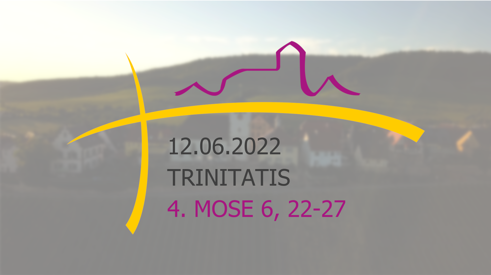

# ThumbnailGen

The ThumbnailGen is a Python application to create thumbnails semi-automatically for the regular Livestream on Sundays in our [Church](https://www.youtube.com/channel/UClapMLdmTYl2hPJB4zVHd1g).

The Thumbnail consists of 3 major parts:

- The blurry background
- the logo of our Church
- and the data consisting of:
  - date
  - name of the Sunday/Event
  - biblical passage

Here is an example of how this looks:

## How to use

The application currently supports automatically providing the date and name of the upcoming Sunday using the downloadable .ics file provided by [www.kirchenjahr-evangelisch.de](https://www.kirchenjahr-evangelisch.de).
The GUI lets you create the Thumbnail for the upcoming Sunday service as well as other events if you tick the Spezial-Checkbox.

If you want to use its full potential, you can download the .ics file [here](https://www.kirchenjahr-evangelisch.de/ical-kalender-download.php). The exact location for the calendar file doesn't matter as long the file is in the repository folder.

## ToDo

- [ ] Look for possibility to fetch calendar data from the website directly instead of having to download the calendar

## Developer

 | [`@ScheerleJo`](https://github.com/ScheerleJo)
